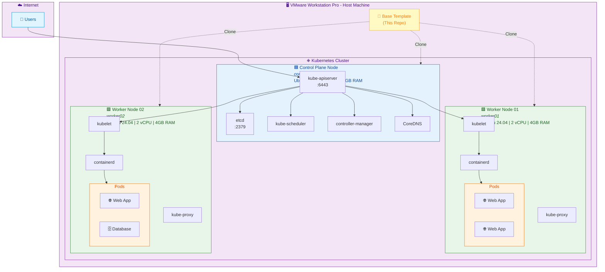
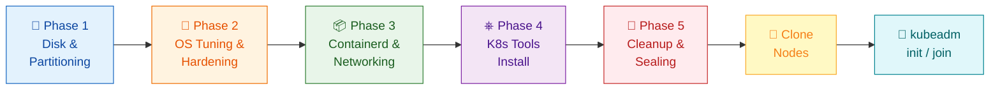

# 🏗️ Ubuntu 24.04 LTS — Kubernetes Node Template

[](https://ubuntu.com/)
[](https://kubernetes.io/)
[](https://containerd.io/)
[](https://www.vmware.com/)
[](LICENSE)

> **Production-grade SOP** for building a reusable Ubuntu 24.04 VM template optimized for Kubernetes clusters running high-performance web applications.

---

## 📖 Table of Contents

- [Overview](#-overview)
- [Cluster Architecture](#-cluster-architecture)
- [Build Pipeline](#-build-pipeline)
- [Partition Layout](#-partition-layout)
- [Quick Start](#-quick-start)
- [Phase Details](#-phase-details)
  - [Phase 1: OS & Disk Foundation](#phase-1-os--disk-foundation)
  - [Phase 2: OS Tuning & Hardening](#phase-2-os-tuning--hardening)
  - [Phase 3: Container Engine & Networking](#phase-3-container-engine--networking)
  - [Phase 4: Pre-baking K8s Tools](#phase-4-pre-baking-k8s-tools)
  - [Phase 5: Cleanup & Sealing](#phase-5-cleanup--sealing)
- [Post-Clone Checklist](#-post-clone-checklist)
- [Troubleshooting](#-troubleshooting)
- [CKA Exam Tips](#-cka-exam-tips)
- [References](#-references)

---

## 🔭 Overview

This repository contains a **Standard Operating Procedure (SOP)** and automation scripts for creating a hardened Ubuntu 24.04 LTS base template designed specifically for Kubernetes clusters.

### Why a Base Template?

| Problem | Solution |
|---|---|
| Manually configuring each node is slow and error-prone | Clone from a single, tested template |
| Version drift across nodes causes cluster instability | Pre-bake exact versions of kubelet, kubeadm, kubectl |
| Swap causes Kubelet failures | Eliminated at partition level + OS level (defense-in-depth) |
| CoreDNS loop on Ubuntu 24.04 | Pre-configured systemd-resolved fix |
| Log files consuming all disk space | Separated `/var` partition + journald rotation |

### Target Stack

- **OS:** Ubuntu Server 24.04 LTS (Minimal)
- **Container Runtime:** Containerd (with SystemdCgroup)
- **Kubernetes:** v1.32 (kubeadm-based)
- **Platform:** VMware Workstation Pro
- **Use Case:** High-performance web applications (Next.js, Go, etc.)

---

## 🏛️ Cluster Architecture



---

## 🔄 Build Pipeline



---

## 💾 Partition Layout

```
┌───────────────────────────────────────────────────┐
│              40 GB Virtual Disk                   │
├──────────┬──────┬───────────┬─────────────────────┤
│   EFI    │/boot │  / (Root) │    /var             │
│   1 GB   │ 2 GB │  15 GB    │    ~22 GB           │
│          │ Ext4 │ Ext4/XFS  │    Ext4/XFS         │
│ Boot     │Kernel│    OS     │ containerd images   │
│ loader   │files │  files    │ kubelet data        │
│          │      │           │ logs (journald)     │
│          │      │           │ etcd data           │
├──────────┴──────┴───────────┴─────────────────────┤
│              ❌ NO SWAP PARTITION                 │
└───────────────────────────────────────────────────┘
```

> **Why separate `/var`?** If containers or logs fill up `/var`, the root filesystem stays intact — you can still SSH in and fix the problem.

---

## ⚡ Quick Start

```bash
# After Ubuntu 24.04 installation with custom partitioning (Phase 1),
# run all phases sequentially:

chmod +x scripts/*.sh
./scripts/phase2-os-tuning.sh
./scripts/phase3-container-networking.sh
./scripts/phase4-k8s-tools.sh
./scripts/phase5-cleanup.sh    # ⚠️ This will shutdown the VM!
```

---

## 📋 Phase Details

### Phase 1: OS & Disk Foundation

> ⏱️ This phase is done during the Ubuntu installer — no script needed.

1. Select **Custom storage layout** in the Ubuntu Server installer
2. Create partitions as shown in the [Partition Layout](#-partition-layout) section
3. **Do NOT** create a Swap partition
4. Select **OpenSSH Server** during installation

---

### Phase 2: OS Tuning & Hardening

📄 **Script:** [`scripts/phase2-os-tuning.sh`](scripts/phase2-os-tuning.sh)

| Step | Action | Why |
|------|--------|-----|
| 2.1 | Update packages & disable swap | Defense-in-depth: prevent OS/cloud-init from creating swap files |
| 2.2 | Enable NTP & expand system limits | etcd requires synchronized clocks; web apps need high file descriptors |
| 2.3 | Journald log rotation & disable unused services | Prevent `/var` from filling up; remove UFW/snapd/multipathd conflicts |

> 💡 **Note — VM Guest Agents:** If running on **VMware**, ensure `open-vm-tools` is installed (included by default on Ubuntu Server 24.04). If deploying this template on **Proxmox**, install `qemu-guest-agent` instead to enable proper VM management from the hypervisor.

> 📝 **Note — Swap in newer Kubernetes:** Kubernetes v1.28+ introduced beta support for swap memory via the `NodeSwap` feature gate. However, disabling swap entirely remains the safest and most trouble-free approach for Home Lab and CKA practice environments.

---

### Phase 3: Container Engine & Networking

📄 **Script:** [`scripts/phase3-container-networking.sh`](scripts/phase3-container-networking.sh)

| Step | Action | Why |
|------|--------|-----|
| 3.1 | Load kernel modules & sysctl | Enable overlay networking and IP forwarding for pod communication |
| 3.2 | Fix CoreDNS loop & fallback DNS | Ubuntu 24.04's stub resolver (127.0.0.53) causes DNS forwarding loops |
| 3.3 | Install containerd & configure crictl | SystemdCgroup = true is critical for stability; sandbox image must match kubeadm version |

---

### Phase 4: Pre-baking K8s Tools

📄 **Script:** [`scripts/phase4-k8s-tools.sh`](scripts/phase4-k8s-tools.sh)

| Step | Action | Why |
|------|--------|-----|
| 4.1 | Add Kubernetes apt repository | Official pkgs.k8s.io repo for v1.32 |
| 4.2 | Install kubeadm, kubelet, kubectl | Pre-installed saves time during clone |
| 4.3 | `apt-mark hold` all three packages | Prevents accidental version upgrades that could break the cluster |

---

### Phase 5: Cleanup & Sealing

📄 **Script:** [`scripts/phase5-cleanup.sh`](scripts/phase5-cleanup.sh)

| Step | Action | Why |
|------|--------|-----|
| 5.1 | `cloud-init clean --logs` | Forces re-initialization of hostname/network on cloned VMs |
| 5.2 | Truncate `/etc/machine-id` | Ensures each clone gets a unique ID (prevents IP/MAC collisions) |
| 5.3 | Clean apt cache | Minimize image size |
| 5.4 | Remove SSH host keys | Prevents cloned nodes from sharing the same SSH fingerprint |
| 5.5 | Truncate system logs | Clean slate — no template logs polluting production nodes |
| 5.6 | Clear bash history & shutdown | Remove traces of setup commands |

> ⚠️ **Warning:** Phase 5 must be the LAST thing you run before cloning. Do NOT boot the VM again after this step.

---

## ✅ Post-Clone Checklist

After cloning the base template to create your cluster nodes, perform these steps on **each cloned VM**:

```bash
# 1. Set unique hostname
sudo hostnamectl set-hostname <node-name>   # e.g., controlplane01, worker01

# 2. Configure static IP (edit netplan)
sudo nano /etc/netplan/00-installer-config.yaml
sudo netplan apply

# 3. Update /etc/hosts on ALL nodes
cat <<EOF | sudo tee -a /etc/hosts
192.168.x.10  controlplane01
192.168.x.11  worker01
192.168.x.12  worker02
EOF

# 4. On Control Plane only:
sudo kubeadm init --pod-network-cidr=10.244.0.0/16

# 5. Install CNI (e.g., Calico or Cilium)
# 6. On Worker nodes: kubeadm join <token>
```

> 💡 **Tip — Kubelet Node IP:** If your VM has multiple network interfaces (e.g., management + cluster networks), kubelet may pick the wrong IP. Fix this by specifying the correct IP in `/etc/default/kubelet`:
> ```bash
> echo 'KUBELET_EXTRA_ARGS="--node-ip=<CORRECT_IP>"' | sudo tee /etc/default/kubelet
> sudo systemctl daemon-reload && sudo systemctl restart kubelet
> ```

---

## 🔧 Troubleshooting

<details>
<summary><b>CoreDNS pods stuck in CrashLoopBackOff</b></summary>

Check if `resolv.conf` still points to `127.0.0.53`:
```bash
cat /etc/resolv.conf
```
If it does, re-run the CoreDNS loop fix from Phase 3.2.
</details>

<details>
<summary><b>kubelet fails to start after clone</b></summary>

Verify machine-id was regenerated:
```bash
cat /etc/machine-id
# Should NOT be empty — if it is, reboot once to regenerate
```
</details>

<details>
<summary><b>Containerd sandbox image mismatch warning</b></summary>

Check what kubeadm expects:
```bash
kubeadm config images list 2>/dev/null | grep pause
```
Update `/etc/containerd/config.toml` if the version differs.
</details>

<details>
<summary><b>Nodes show NotReady status</b></summary>

This is normal before installing a CNI plugin. Install Calico or Cilium, then nodes will transition to Ready.
</details>

<details>
<summary><b>kubelet picks wrong IP address on multi-NIC VMs</b></summary>

If your VM has multiple network interfaces, kubelet may register with the wrong IP. Set the correct one explicitly:
```bash
echo 'KUBELET_EXTRA_ARGS="--node-ip=<CORRECT_IP>"' | sudo tee /etc/default/kubelet
sudo systemctl daemon-reload && sudo systemctl restart kubelet
```
</details>

---

## 🎓 CKA Exam Tips

If you're using this template to prepare for the **Certified Kubernetes Administrator (CKA)** exam, here are some relevant tips:

| Topic | How This Template Helps |
|-------|------------------------|
| **Cluster Upgrade** | Phase 4 uses `apt-mark hold` to lock package versions. The CKA exam tests your ability to `unhold` → upgrade `kubeadm/kubelet/kubectl` to a specific version → `hold` again. Practicing with this template builds muscle memory for that process. |
| **etcd Backup & Restore** | The partition layout separates `/var` which contains etcd data. This structure supports adding automated etcd backup scripts in the future — a critical CKA exam topic. |
| **Node Troubleshooting** | The `crictl` configuration (Phase 3.3) lets you inspect containers directly on a node without Docker — an essential debugging skill tested in the CKA exam. |
| **Networking** | The kernel modules and sysctl settings (Phase 3.1) are the foundation that makes pod-to-pod communication work. Understanding *why* `br_netfilter` and `ip_forward` are needed helps you troubleshoot networking questions on the exam. |

---

## 📚 References

- [Kubernetes Official Documentation — Installing kubeadm](https://kubernetes.io/docs/setup/production-environment/tools/kubeadm/install-kubeadm/)
- [Containerd Getting Started](https://github.com/containerd/containerd/blob/main/docs/getting-started.md)
- [CKA Certification Curriculum](https://github.com/cncf/curriculum)
- [Ubuntu 24.04 Server Guide](https://ubuntu.com/server/docs)

---

## 📄 License

This project is licensed under the MIT License — see the [LICENSE](LICENSE) file for details.

---

<div align="center">

**Built with 💜 for the DevOps & Kubernetes community**

*Part of CKA certification journey — from SysAdmin to Cloud Native Engineer*

</div>
